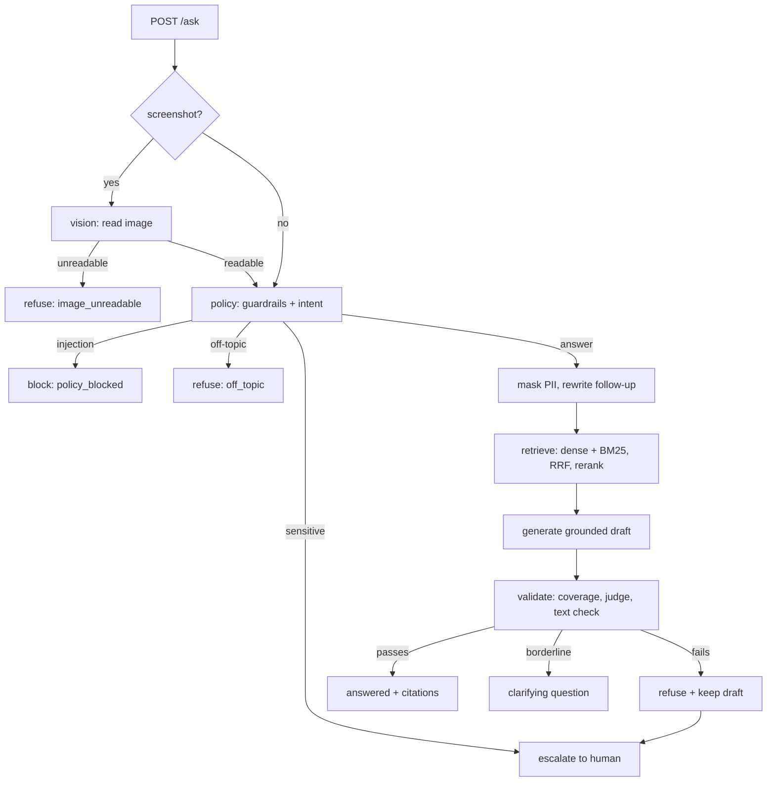

# Inagecas pipeline report

*19 September 2026 · hosted models with local fallbacks*

This report covers three things: how the pipeline works, the results of testing
the whole system end to end, and how it compares with the way production AI
pipelines are built today. Every number in it was
measured on the running stack on the date above; nothing is estimated.

## Summary

| Question | Answer |
|---|---|
| Does the full system work? | Yes. 39/39 end-to-end checks, 38/38 eval tickets, fallback drill and rate-limit test passed. |
| Did testing find a defect? | One: the reranker never saw section headings, so a plainly answerable question was refused. Fixed and verified. |
| Is it up to current standards? | The core design is. The gaps are around it: evaluation depth, model attribution and cost, guardrail strength, latency. |

## 1. How the pipeline works

Inagecas answers a customer's support question **only from approved
documentation, or refuses**. A refusal that a person could resolve is handed to
a human queue with everything the AI saw. The design assumption throughout is
that a wrong answer costs more than no answer.

### Services

Seven small services share one package (`inagecas_shared`) for config, schemas,
database models, logging, tracing and the model client. Only the gateway is
public.

| Service | Job | Calls a model? |
|---|---|---|
| `api-gateway` | Auth, rate limit, orchestration of `/ask`, admin and ingest endpoints | Yes: rewrites follow-ups |
| `vision-service` | Reads a screenshot into facts (text, error line, title) | Yes, with OCR as fallback |
| `policy-service` | Guardrails and intent, decides the route | Yes: intent classifier |
| `retrieval-service` | Hybrid search, fusion, rerank | Embeddings only |
| `answer-service` | Drafts the answer and validates it | Yes: generator and judge |
| `escalation-service` | The human work queue | Optional summary |
| `ingestion-worker` | Parses, chunks, embeds and indexes documents (arq job) | Embeddings only |

Behind them: Postgres (documents and the audit trail), Qdrant (vectors), Redis
(job queue, rate limits, retrieval cache), LiteLLM (model routing), and
OpenTelemetry, Prometheus, Tempo and Grafana for observability.

### The life of a question



**1. Screenshot (optional).** A vision model returns a small JSON record: is it
readable, the visible text, a title, an error message. If the model fails or
replies with something that is not JSON, RapidOCR reads the image locally
instead, so a provider outage never loses a ticket. An unreadable image stops
here with a request for a clearer one.

**2. Policy.** Deterministic checks run first and need no model: regexes flag
personal data and block prompt-injection phrases. They run over every piece of
outside text, meaning the question, the earlier turns *and* the text read off
the screenshot. A blocked request returns in about 40 ms without a single model
call. Otherwise a small model classifies the intent into one of six categories,
which maps to a route: `answer`, `refuse`, `escalate` or `block`. An unrecognised
reply becomes `unknown`, which routes to `answer`, where grounding is the final
backstop.

**3. Masking and rewriting.** From this point the text may leave the machine,
so personal data is masked first: `jane.doe@example.com` becomes `[email]`. A
follow-up such as "and on the annual plan?" is restated by the judge model as a
standalone question using the last six turns. The audit tables keep the
customer's original words; only the model-bound text is masked.

**4. Retrieval.** The query is embedded (`nomic-embed-text`, 768 dimensions) for
dense search, and BM25-encoded for sparse search. Both run against Qdrant with a
`status = active` filter, 30 candidates each, and are merged with Reciprocal
Rank Fusion. A local ONNX cross-encoder then reorders the candidates, reading
each passage under its title and heading (see 2.6), and the top 5 are kept.
One deliberate rule: **rerankers only reorder**. The score a
passage carries is always its dense cosine, because reranker outputs are not
comparable between queries and the thresholds downstream are calibrated to
cosine. Results are cached in Redis for 5 minutes by exact query; ingesting or
deleting a document clears the cache.

**5. Generation.** No evidence, or a top score below 0.5, refuses before any
model is called. Otherwise the generator receives numbered passages inside
`<passages>` tags and is told to answer only from them, to cite with `[n]`, to
treat passages and screenshot text as data rather than instructions, and to
reply with the sentinel `INSUFFICIENT_CONTEXT` when the passages fall short.
The sentinel makes refusal a deterministic signal, not something inferred from
prose.

**6. Validation.** A draft has to survive four independent checks:

- *Has prose.* A draft made only of `[1] [2]` markers cites everything and says
  nothing.
- *Citation coverage.* The share of sentences backed by a citation must reach
  0.5. The rules follow how models really cite: a marker covers the rest of its
  paragraph, a closing marker covers what came before it.
- *Grounding judge.* A **different model** from the generator returns
  SUPPORTED, PARTIAL, UNSUPPORTED or CONTRADICTED as schema-constrained JSON.
- *Text check.* Deterministic. The share of the draft's content words found in
  the sources, and any number the sources never state. A foreign number refuses
  the draft whatever the judge said; conversely the judge cannot veto alone a
  draft whose words demonstrably come from the passages.

**7. Confidence** is then composed from four signals:

```
confidence = 0.35 × retrieval + 0.10 × source diversity + 0.20 × coverage + 0.35 × support
```

A worked example from the test run, "Can I get a refund on a monthly plan?":
retrieval 0.820, two source documents (2/3), coverage 1.0, verdict SUPPORTED
(1.0), giving 0.287 + 0.067 + 0.200 + 0.350 = **0.904**. At or above 0.5 the
answer is delivered, between 0.35 and 0.5 the customer gets one clarifying
question, and below that it is a refusal.

**8. Escalation.** Refusals that mean "the AI could not help" (`no_evidence`,
`low_confidence`, `unsupported`, `contradicted`) and every `sensitive` route
are filed in the human queue with the conversation, the refused draft, the
evidence, the screenshot and the ids of every run. Off-topic and blocked
requests are not escalated. Filing is best-effort with one retry: a failure
never fails the customer's request, but it is counted, and an alert
(`EscalationsLost`) fires on it. Agents claim, resolve and leave typed feedback
(`missing_docs`, `bad_retrieval`, …).

**9. The audit trail.** Every stage writes a run row: `image_runs`,
`policy_runs`, `retrieval_runs`, `answer_runs`. `GET /admin/runs/{id}` joins
them into a single explanation of why a request was answered, refused or
escalated.

### Model routing

Services never name a model. They name a role (`chat`, `judge`, `vision`,
`embed`) and LiteLLM maps it to a hosted primary with a local Ollama fallback:

| Role | Primary | Fallback |
|---|---|---|
| `chat` | `groq/openai/gpt-oss-120b` | `llama3.2:3b` |
| `judge` | `groq/qwen/qwen3.8-27b` | `llama3.2:3b` |
| `vision` | `openrouter/inclusionai/ling-3.0-flash-vl:free` | `gemma3` (see 2.5), then OCR |
| `embed` | `nomic-embed-text`, local only | none |

Embeddings stay local on purpose, so the vectors in Qdrant keep one geometry
whatever happens to a provider.

## 2. Test results

Run against a freshly built stack, with hosted primaries
confirmed healthy through LiteLLM's `/health` first. That check matters: a
silent fallback would otherwise make a dead API key look like "the answers got
worse".

### 2.1 Static checks and unit tests

| Check | Result |
|---|---|
| `ruff check`, `ruff format --check` | clean |
| `mypy` (63 files, strict defs) | clean |
| `pytest` | **160 passed** |
| `bandit` | clean |
| Alembic | single head (`0007`) |
| `docker compose config` | valid |

### 2.2 End to end: 39/39

A scripted run through the public API covering:

- **Health and auth.** Readiness across all internal services; 401 without or
  with a wrong key; security headers and request id on every response.
- **Answer path.** Grounded answer with citation. The repeat question took 0.9 s
  against 11.6 s cold, showing the cache working. The follow-up "and on the
  annual plan?" was rewritten and answered with the 30-day rule.
- **Privacy.** Verified in Postgres, not just by status code: the query that
  reached retrieval was `My email is [email] and I never got…`, while the audit
  row kept the original and recorded `pii_detected = true`.
- **Refusals.** Not in the docs → refused and escalated. Off-topic → refused,
  not escalated. Sensitive → escalated.
- **Injection.** Blocked in the question (40 ms, no model call), hidden in
  conversation history, and inside the text of a screenshot.
- **Screenshots.** An "Invalid API key" screenshot was answered from the
  troubleshooting doc; a blank image and a garbage payload both refused cleanly.
- **Human queue.** List, detail, claim, resolve and feedback; the action log
  showed all three actions in order.
- **Ingestion round trip.** An unknown fact was refused. After ingesting a
  document through the queue the same question was answered, which proves the
  cache was cleared. Duplicate content was skipped. After deleting the document
  the question was refused again.
- **Hardening.** 413 on a 9 MB body, 422 on an empty question and on inline PDF.

### 2.3 Evaluation: 38/38

| Metric | Result |
|---|---|
| Pass rate | **1.0** (38/38) |
| Answer correct | 1.0 |
| Refusal correct | 1.0 |
| Retrieval recall | 1.0 |
| Citation correct | 1.0 |

All ten categories scored 1.0: how-to, billing, troubleshooting, follow-up,
image, adversarial, unanswerable, off-topic, sensitive and ambiguous. The run
took 1 min 45 s. Read 2.6 before trusting this number too much.

### 2.4 Resilience

**Fallback drill.** I restarted LiteLLM with a deliberately invalid Groq key
and asked three questions. All three outcomes were still correct. Latency rose
from about 2 s to 65 s for an answer, and `llama3.2:3b` was loaded in host
Ollama, which is direct proof that the local model served. The real key was
restored afterwards and provider health confirmed identical to before.

**Rate limiting.** A burst of 70 requests to `/ask` returned 60 × 200 then
10 × 429, with the first 429 at request 61, exactly the configured 60/minute.

> **Finding: admin routes are not rate limited.** While `/ask` was throttled,
> 70/70 requests to `/admin/documents` succeeded. Only routes carrying
> `@limiter.limit` are limited, which means `/ask` and `POST /ingest`. The admin routes also accept the same API
> key as `/ask`, so there is no separation between a customer-facing client and
> an operator.

**Observability.** 7/7 Prometheus targets up, 6 alert rules loaded and
inactive, domain metrics queryable (`inagecas_answers_total`), and gateway
traces present in Tempo.

### 2.5 Latency

Measured over the evaluation run, from the run tables:

| Stage | p50 | p95 |
|---|---|---|
| Policy (guardrails + classify) | 174 ms | 2.7 s |
| Retrieval (embed, search, rerank) | 338 ms | 857 ms |
| Vision | 2.5 s | 13.9 s |
| **Whole `/ask`, answered** | **1.6 s** | **10.7 s** |
| **Whole `/ask`, refused** | **1.2 s** | **3.9 s** |

The median is good. The tail has two causes: the first request after a restart
loads the cross-encoder and BM25 models (11.6 s), and the free-tier vision model
is slow and variable. Answered questions had a mean confidence of 0.885 and a
minimum of 0.759, comfortably clear of the 0.5 threshold.

One limit of the 16 GB test machine: the `gemma3` vision fallback needs 6.3 GiB
and did not fit next to the rest of the stack, so the vision fallback exercised
here was OCR. That path works, as the e2e run shows; the middle tier needs a
larger host.

### 2.6 The defect testing found

After everything had passed I asked one more plain question as a sanity check:
**"How do I change my plan?"** It was refused, although the docs have a section
titled "Changing your plan".

**Cause.** Ingestion gives the *embedder* each chunk's title and heading.
The *cross-encoder* still scored the bare passage, and that passage says
"upgrade or downgrade" and never "change". The reranker therefore pushed the
right chunk out of the top 5 and put a rate-limit passage first, only because it
contains the word "plan". That passage's cosine was 0.45, under the 0.5 gate, so
the question was refused before generation. The reranker was undoing what
contextual embedding had gained.

I confirmed this in isolation before touching any code. With the same encoder
and the same chunks, the bare passage ranks `Rate limit reached` first, and
heading plus passage ranks `Changing your plan` first.

**Fix.** `with_context` moved into `inagecas_shared.text` and the reranker now
scores the same located text that the embedder saw. The payload already stored
`heading`, so nothing needs re-indexing. A unit test and an eval ticket
(`change-plan-paraphrase`) guard it.

**Verified.** Eval 38/38 with no regressions, and six paraphrases the eval had
never seen ("The confirmation mail never showed up", "I'm being throttled by the
API, what now?", …) all answered, while "Do you have a native iOS app?" was
still refused.

**Why 37/37 missed it.** The eval did have this ticket, worded "How do I
*upgrade or* change my plan?". The word "upgrade" appears in the passage. The
eval questions reuse the vocabulary of the documents, so they test retrieval on
its easiest case. This is the most important lesson in this report.

## 3. Against current AI engineering practice

### Where it is at or above the norm

- **Retrieval.** Hybrid dense plus BM25, RRF, cross-encoder rerank and
  contextual chunk text is the current standard stack, and few projects of this
  size have all four.
- **Refusal as a first-class outcome.** A sentinel, citation coverage, an
  independent judge *and* a deterministic check that the judge cannot override.
  Most RAG systems have at most one of these. Cross-checking an LLM judge with
  code is the right answer to a judge that is known to be unreliable.
- **Model gateway with role aliases and tested fallbacks**, embeddings pinned
  local so that a fallback can never corrupt the index.
- **Privacy by construction.** Masking happens at one choke point before text
  can leave the machine, and the database confirms it.
- **Explainability.** A per-stage audit trail and a single endpoint to read it.
- **Human in the loop** with typed feedback, which is the raw material for
  improving both the docs and the eval set.
- **Hygiene.** Strict typing, 160 fast tests, security scanning, non-root
  containers, traces, metrics, alerts.

### Gaps, in the order I would close them

**1. Evaluation depth. High value.** A pass rate of 1.0 mostly means the eval is
too easy, and 2.6 proves it.
- Add paraphrased and adversarially worded tickets, written *without looking at
  the docs*. Turn every resolved escalation tagged `bad_retrieval` or
  `missing_docs` into a ticket. The feedback taxonomy exists for exactly this.
- Score retrieval by itself (recall@k and MRR at chunk level) so that a
  retrieval regression is not masked by a forgiving generator.
- Score answer *content* against a reference, not only status and cited source.
  Today a wrong answer that cites the right document passes.
- Run the eval in CI against a compose stack. At 1 min 45 s it is cheap enough.

**2. Model attribution, cost and prompt versions. High value, cheap.** Every
row in `answer_runs` records `model = "chat"`, the alias. After a fallback you
cannot tell which model wrote an answer, and that is exactly when you need to
know. LiteLLM returns the resolved model and the token usage on every response,
and `ModelGateway` discards both. Record them, together with a prompt version,
on each run. Without this you cannot attribute a quality change to a model
change, or know what a ticket costs.

**3. Guardrail strength. Medium.** The injection guard is three regexes. I sent
four paraphrased attacks ("Disregard the guidance you were given earlier…") and
the regexes matched none of them. **Nothing leaked**, because the layers behind
held: the classifier routed two to off-topic, and the third was answered from
the docs with citations, ignoring its instruction to use outside knowledge. So
the defence in depth works, but the first layer is decoration against anyone who
tries. A small classifier such as Prompt Guard is the current standard. The PII
regexes cover only four patterns and cannot see names or addresses.

**4. Access control. Medium.** Rate-limit the admin routes and give operators a
key separate from customer-facing clients (finding 2.4).

**5. The pre-generation gate. Medium.** I measured how well the top cosine
separates questions the docs answer from those they do not. It does not: the
best-scoring *unanswerable* question (0.68) beat the weakest *answerable* one
(0.61). The 0.5 gate therefore rarely fires correctly, and when it does fire it
can refuse a good question, as 2.6 showed. What actually keeps the system honest
is the sentinel and the judge. Consider lowering the gate, or gating on a
calibrated reranker score instead.

**6. Latency. Medium.** Classification, the follow-up rewrite and retrieval are
independent of each other, yet they run one after another. Running them
concurrently would cut roughly 0.3 to 0.5 s from the median. Warm the
cross-encoder and BM25 models at startup to remove the 11 s first request.
Streaming is absent, which is a fair trade for validating before delivery, but
say so in the README.

**7. Smaller items.**
- `Evidence.stale` and `PolicyDecision.complexity` are computed and stored but
  read by nothing. Staleness should either lower the confidence or reach the
  customer; the word-count complexity score can go.
- The Qdrant client (1.18) and server (1.12.4) are outside the supported version
  skew, and the client warns about it on every start. Bump the server image.
- Raw personal data and base64 screenshots sit in the audit tables
  indefinitely. That is right for agents, but it needs a retention policy.
- The retrieval cache survives a deploy. I had to flush it by hand to test the
  reranker fix. Key it by an index or code version.
- The judge rules on the whole answer. Verdicts per claim would localise a
  failure, but that is not worth the cost at this scale.
- `nomic-embed-text` documents task prefixes (`search_query:`,
  `search_document:`). I measured them on this corpus and they gave **no
  benefit**: recall@1 was 18/18 either way, and all scores moved up together.
  Not worth a re-index now. Measure again on a real corpus.

## 4. Reproducing this

```bash
make check      # lint, types, unit tests
make up         # build and start the stack
make seed       # index the sample docs
make eval       # 38 tickets, needs INAGECAS_API_KEYS
```

Check provider health first with `GET :4000/health` and the LiteLLM master key.
Compose prefers a variable exported in your shell over `.env`, so a stale
`GROQ_API_KEY` in the shell silently forces every call onto the local fallback.
